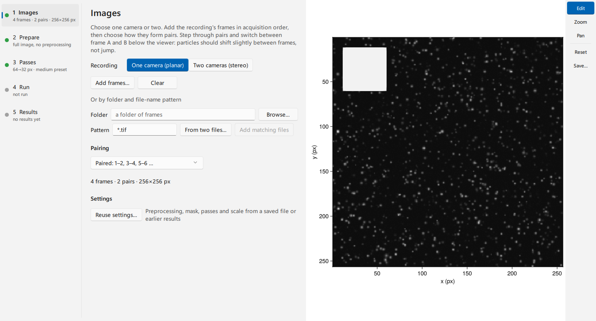
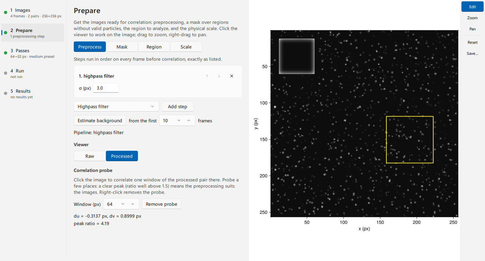
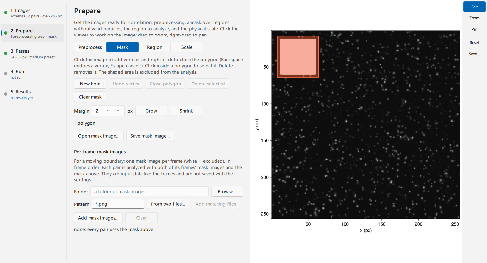
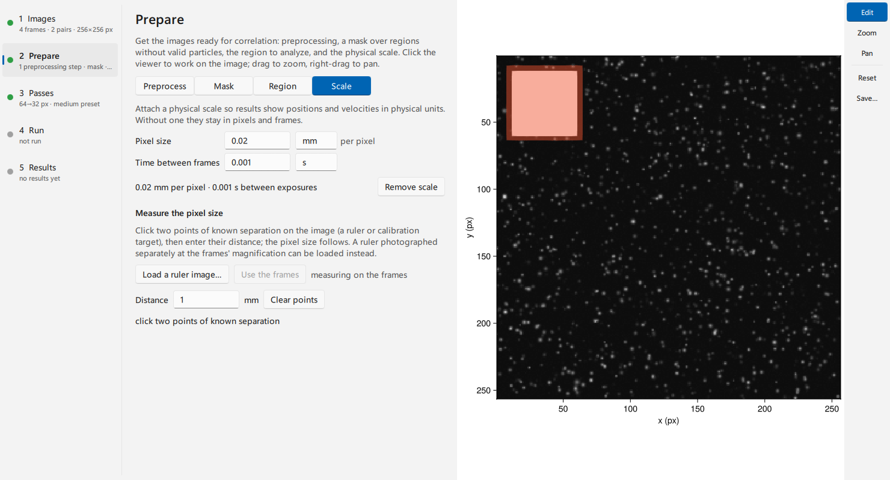
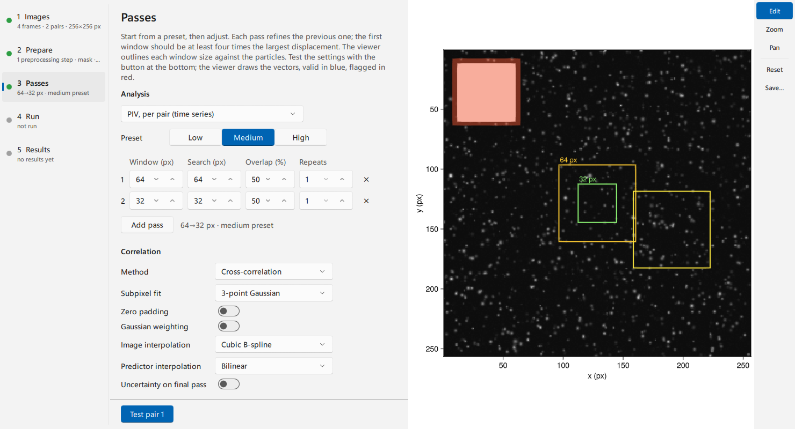
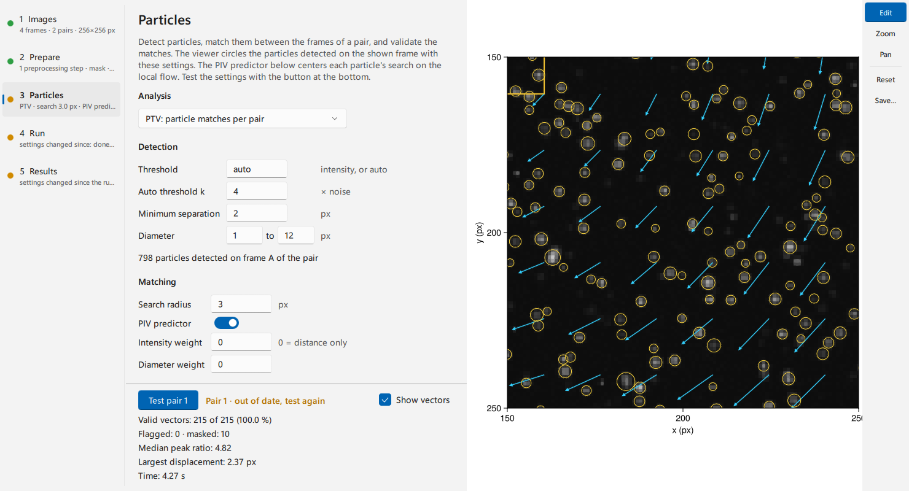
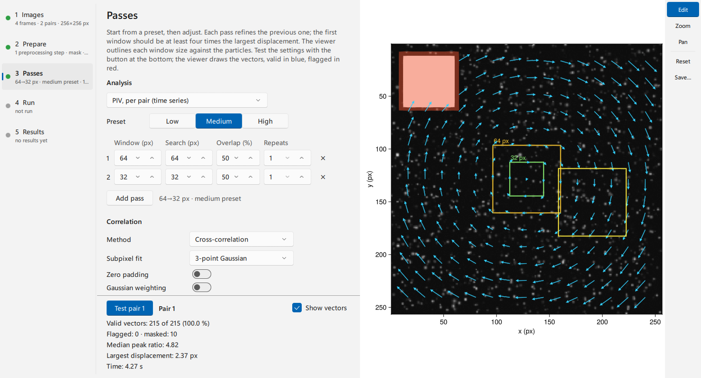
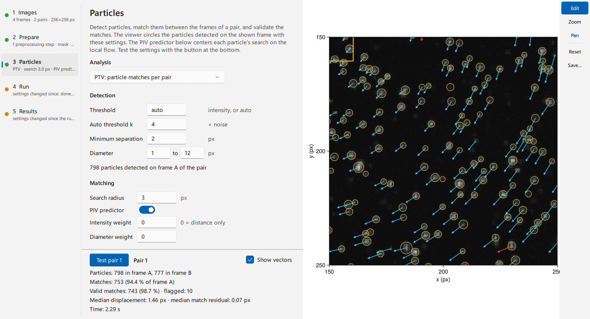
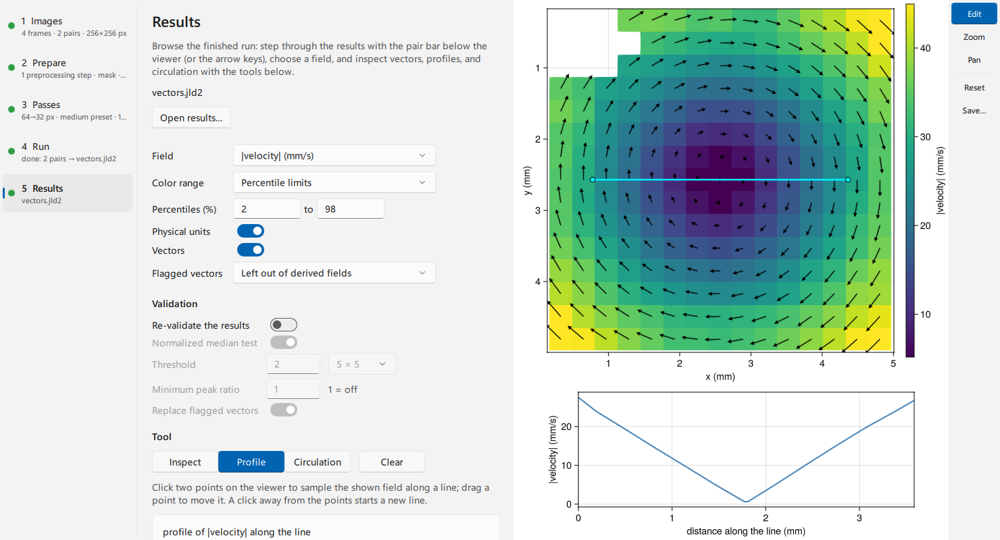

# Analyze an image pair in the GUI

The Hammerhead window takes the frames of a recording through image checks,
masking, the pass schedule, a test on one pair, the batch run, and the
results. This page covers one-camera (planar) recordings; for two cameras see
[Run stereo PIV in the GUI](gui_stereo.md).
[A PIV session in the GUI](../tutorials/gui_tour.md) is a complete
session on sample images.

## Open the window

Install the GUI package with `pkg> add HammerheadGUI`. Start Julia with
several threads, so tests, runs and previews leave the window responsive:

```julia
# julia -t auto
using HammerheadGUI
wf = hammerhead()
```

The call returns when you close the window. It returns the window's
session, a `PlanarWorkflow` for a one-camera recording, with every setting
you made. Pass frames or saved settings to start further along:
`hammerhead(files = paths, settings = "settings.toml")`.

**Recording** at the top of **Images** chooses one camera (planar PIV and
particle analysis) or two (stereo PIV, with a Calibration step). The window
holds one recording at a time: changing the type starts a fresh session,
and the window first lists what that discards (frames, unsaved settings,
results kept only in memory). Opening settings or results of the other
type switches the same way.

The steps on the left run in order: **Images → Prepare → Passes → Run →
Results**. Each step shows a one-line summary, and a dot marks it as to do,
done, needing attention, or busy; **Prepare** and **Passes** stay grey until
the frames on **Images** form pairs. Changing a setting after a test or run
marks **Passes**, **Run** and **Results** as needing attention until they are
repeated. The viewer on the right follows the step: frames and overlays
while you prepare, window outlines and the test's vectors on **Passes**,
vectors of the latest pair on **Run**, and the result field on **Results**.
The toolbar at the viewer's right edge sets what a drag does: **Edit** (the
default: clicks work on the open step, a left-drag zooms to a box, a
right-drag pans), **Zoom** (drag a box; clicks do not edit) and **Pan**
(drag to move). The wheel zooms in every mode; **Reset** (or ctrl+click)
shows the whole image, and **Save…** writes the viewer as a PNG image.
**Auto contrast** in the bar below stretches the displayed intensities;
the analysis always uses the frames' values. **Pop out viewer** in the
window's toolbar moves the viewer into its own window, for a second screen.
Closing that window docks the viewer again.

Keys: ← and → step through the pairs (on **Results**, through the
results); A and B, or shift+← and shift+→, switch between frame A and B.

## Add the frames

On **Images**, click **Add frames…** and select the frames, or give a
**Folder** and a file-name **Pattern** (`*` matches any run of characters,
`?` one character) and click **Add matching files**; matching files are
added in natural order, so `frame_2` comes before `frame_10`. **From two
frames…** derives the folder and pattern from two frames of the recording,
for example the first pair. Then choose
**Pairing**: **Paired** for separate A/B exposures (1–2, 3–4), **Chained** for a
uniformly sampled sequence (1–2, 2–3). The bar at the bottom of the window selects the
*representative pair* and switches between frame A and frame B. Previews,
probes, window outlines and the test use this pair. Choose one with the
flow features you care about; dim or fast regions are good checks.



Frames load in the background. The step rail shows "loading…" until a new
pair arrives, and the viewer keeps the previous one meanwhile.
**Reuse settings…** takes the settings of a saved settings file or of an
earlier run's results file.

## Prepare the images

**Prepare** has four pages. Clicks on the viewer go to the open page.

### Preprocess and probe the correlation

Add steps with **Add step**; they run in the listed order on every frame
before correlation. The arrows reorder a step, **✕** removes it, and each
option is edited in place. **Estimate background** takes the pixel-wise
minimum of the first frames and subtracts it as the first step. It runs in
the background; a status line reports progress.

Switch the viewer between **Raw** and **Processed**, then click the image to
place the **correlation probe**. The probe correlates one window of the
processed pair there and reports the displacement and the peak ratio. A ratio
well above 1.5 means a clear match. Probe a few places, including weak
regions. The preview runs exactly the preprocessing the batch runs, so what
you see is what will be correlated.
[Build a preprocessing chain](preprocessing.md) explains when each operation
helps.



### Mask walls and reflections

On **Mask**, click the image to add polygon vertices and right-click to
close the polygon. The shaded area is excluded from the analysis.

- **Backspace** undoes the last vertex; **Escape** cancels the polygon.
- Click inside a finished polygon to select it; **Delete** removes it.
- **New hole** makes the next polygon restore an area inside an excluded
  region.
- **Grow** and **Shrink** widen or narrow the excluded area by a margin. The
  polygons then become a fixed raster mask, which you can still draw on.
- **Open mask image…** reads a mask file (white = excluded), and **Save mask
  image…** writes one.



This mask is static: it stays in the lab frame for every pair. For a boundary
that moves, add **Per-frame mask images** below it: one image per frame
(white = excluded), in frame order, chosen as files or by folder and pattern
as on **Images**. Each pair is analyzed with both of its frames' mask images
and the static mask, and the viewer shades the representative pair's
combined mask. Mask images are input data like the frames, so they are not
saved with the settings; they apply to PIV per pair and PTV. For automatic
masks and the masking model, see [Mask reflections and geometry](masking.md).

### Analyze part of the frame

On **Region**, click two opposite corners on the image or type inclusive row
and column bounds, then **Apply bounds**. **Full image** removes the region.
Results keep the original image coordinates, and the pass presets size
themselves to the region.

### Attach a physical scale

On **Scale**, type the pixel size with its length unit and the time between
the paired exposures with its time unit. For example, 0.02 mm per pixel and
0.001 s. To measure the pixel size, click two points of known separation on
the image, such as ruler marks, and type their **Distance**. **Load a ruler
image…** measures on a separate photograph of a ruler or target taken at the
frames' magnification instead; **Use the frames** returns to the frames.
Without a scale,
results stay in pixels and frames. Vectors are always computed in pixels; the
scale converts what the results show (see
[Scale results to physical units](scaling.md)).



## Choose the passes

**Analysis** at the top of **Passes** chooses what the window measures: PIV
per pair, a PIV ensemble, particle matches per pair (PTV), or particle tracks
through the frames. For PIV, click a preset: **Low**, **Medium** or **High**. The preset fills
the pass table for the frame or region size; edit any cell to make the
schedule your own. The first window should be at least four times the largest
displacement. The viewer outlines each window size against the particles
to help you judge this. [Choose an effort level](effort.md) explains the
trade-off.

Below the table:

- **Correlation:** method, subpixel fit, **Zero padding** and **Gaussian
  weighting** (together the most accurate setting), the deformation's
  **Image interpolation** (cubic B-spline, or faster bilinear with a
  sub-pixel bias) and **Predictor interpolation** (bilinear, or cubic for
  strongly curved flow), and per-vector **Uncertainty on final pass**.
- **Validation:** the normalized median test (threshold and neighborhood),
  a minimum peak ratio, and whether flagged vectors are replaced.
- **Correlation probe:** click the viewer to correlate one window of the
  final pass's size on the processed pair, as on **Preprocess**.
- **Precision:** Float32 halves the memory of Float64.
- **Run on the GPU:** tests and runs use CUDA (NVIDIA) or AMDGPU (AMD) when
  one of those packages is installed in the environment. The first switch-on
  loads the package, which takes a while. GPU backends cover PIV per pair
  and ensembles with the default interpolation, equal search and window
  sizes, and the 3- or 9-point subpixel fit; with a setting outside that
  range the switch is greyed out and its tooltip names the setting. Particle
  analysis runs on the CPU, so the particle modes have no switch. See
  [Run PIV on a GPU](gpu.md).

A **PIV ensemble** sums the correlation over all pairs into one mean field
(see [Measure one field from many pairs](ensemble.md)). The window tests an
ensemble on the first ten pairs and runs it on all pairs. An ensemble runs
each pass once, so the **Repeats** column is unavailable; add a pass to
repeat a window size.



### Match or track particles

Choose **PTV** or **Particle tracking** under **Analysis** to follow
individual particles instead of correlating windows. The step is then called
**Particles**, and the viewer circles the particles detected on the shown
frame, after preprocessing and inside the mask, as you change the settings:

- **Detection:** an **auto** threshold (median plus k times the frame's noise)
  or an intensity, the minimum separation between particles, and the range of
  particle diameters. The count under the settings follows each change.
- **Matching:** the **Search radius** around each particle's predicted
  position in the second frame. With **PIV predictor** on, the pass table
  below runs first and centers each search on the local flow, so the radius
  only has to cover the prediction's error; turn it off for displacements
  smaller than the radius. Intensity and diameter weights make matching
  prefer particles that look alike.
- **Validation:** a normalized median test against neighboring matches flags
  outliers; flagged matches stay in the result, marked.
- **Tracks** (tracking only): the shortest track kept and how many missed
  frames a track may bridge.



Tracking follows every frame in the order listed on **Images**, so it needs a
time-resolved recording; the pairing there only picks the representative
pair. Particle analysis covers whole frames: use a mask rather than a region.
See [Track particles](../tutorials/ptv.md) for the method.

## Test one pair

The bar at the foot of **Passes** stays in view while you scroll the
settings. Click **Test pair** there (or **Test ensemble**, which uses the
first ten pairs). The test runs the same call the batch will run. It reports
the valid and flagged fractions, the median peak ratio, the largest
displacement and how long the test took, with the change from the previous
test. The viewer draws valid vectors in blue and flagged vectors in red over
the window outlines; **Show vectors** hides them, for instance to place the
correlation probe on the particles underneath. When you change a setting or
the representative pair, the bar says the test is out of date until you test
again.



Many red vectors usually mean the first window is too small for the
displacement, or that a region needs a mask or preprocessing.
[Tune validation](validation.md) covers the outlier test.

In PTV mode the test matches the particles of the representative pair and
reports the particle counts, the share of frame-A particles matched, the
valid matches, and the median displacement and match residual; the viewer
shows each match as an arrow. A tracking test follows up to ten frames from
the representative pair and draws the tracks.



## Run the recording

On **Run**, choose an output file with **Browse…** (leave it empty to keep
results in memory), then click **Run**. Results are written as each pair
finishes, together with the settings that produced them. The viewer shows
the latest finished pair, with elapsed time and an estimate of the time left.
**Cancel** stops after the pair in progress and keeps the finished ones.
**Clear** empties the output path. Results kept in memory can still be
written afterwards with **Save results…**, together with their settings and
frame paths, without running again.
Closing the window also cancels a run in this way.

An ensemble run (**Run ensemble of N pairs**) pools every pair into one
result, which is written with the settings when the run finishes. Its
progress counts the pairs of each pass. Canceling an ensemble stops after
the pair in progress and keeps no result.

A PTV run writes one particle result per pair, like a PIV run. A tracking
run (**Track through N frames**) writes one set of tracks when it finishes;
its progress counts frame steps, and canceling keeps no result.

## Inspect the results

When a run finishes, **Results** holds its output. **Open results…** browses
another results file; entries load one at a time.

- The pair bar below the viewer (or ← / →) steps through the results,
  independently of the representative pair of the earlier steps.
- **Field** chooses what is colored: components, magnitude, diagnostics,
  derived fields such as vorticity (signed fields use a diverging scale
  centered on zero), and the **particle image** of the result's pair, whose
  frame **Frame A** / **Frame B** (or A / B) switch.
- **Color range:** **Percentile limits** take the given percentile band of
  the valid values (2–98 % by default); **Absolute limits** pin both ends,
  starting from the range shown, and keep them across results.
- **Physical units** (with a scale attached) switches between physical and
  measured units.
- **Flagged vectors** sets whether derived fields, profiles and circulation
  use flagged vectors (with their replacement values) or leave gaps.
- **Validation › Re-validate the results** checks the shown vectors again
  with other outlier-test settings and optional replacement. Only the
  display changes; the results are unchanged.
- **Inspect:** click a vector to read its position, components and status.
- **Profile:** click two points to sample the shown field along a line. A
  panel under the field plots it.
- **Circulation:** click contour vertices and right-click to close the contour.
  The summary gives Γ from the line integral and from the enclosed vorticity,
  and the covered fraction when masked or flagged cells leave gaps.
- Drag a profile endpoint or contour vertex to move it; the profile or
  circulation follows. Click a point and press Delete to remove it.
- **Clear** (or Escape on the viewer) removes the line or contour.



PTV results show each particle colored by the chosen field with its
displacement; tracks are drawn as lines colored by mean speed, broken where
a track bridged missed frames. With a scale attached, axes, color bars and
summaries use its units.
Profile and circulation need a planar PIV result. Check flagged vectors and the mask
before you interpret derived quantities, because derivatives amplify local
errors.

## Save and reuse the settings

**Save settings…** writes the passes, preprocessing, mask, region and scale to
a recipe file: plain TOML text, with the mask and any background as image
files beside it (choose a `.jld2` name for a single file instead).
**Open settings…**, or **Reuse settings…** on **Images**, reads
a recipe file or the settings stored in any results file. A dot after the
title in the window bar marks unsaved
changes. Settings files are core recipes, so a script can run them with
`apply_recipe`. See [Save settings and reuse them](recipes.md).

## Browse a results file without the workflow

The standalone result explorer opens a completed file and loads one entry at
a time:

```julia
using HammerheadGUI
result_explorer("vectors.jld2"; lazy = true)
```

It browses planar and stereo PIV, PTV particles and trajectories. The
[result explorer reference](../reference/gui_results.md) lists its fields
and tools.

Open it in its own Julia session. The explorer is a GLMakie window, and
GLMakie windows and the workflow windows cannot share a session (some
graphics drivers crash): once a GLMakie window exists, `hammerhead` throws
an error asking you to restart Julia, and `result_explorer` warns when a
workflow window was already open. Within the workflow window, browse results
on **Results**.

## Work with two cameras

For a stereo rig, choose **Two cameras (stereo)** on **Images** (or start
with `hammerhead(type = :stereo)`): the window adds a Calibration step and
runs both cameras on a common dewarped grid; the other steps are the ones
above. See [Run stereo PIV in the GUI](gui_stereo.md).

## Script the window's steps

Every button calls a function on the workflow's controllers in
`HammerheadGUI.Controllers`, so the same steps run without a window. The
[GUI tour](../tutorials/gui_tour.md) shows the code next to each click, and the
[GUI reference](../reference/gui.md) lists the functions.
