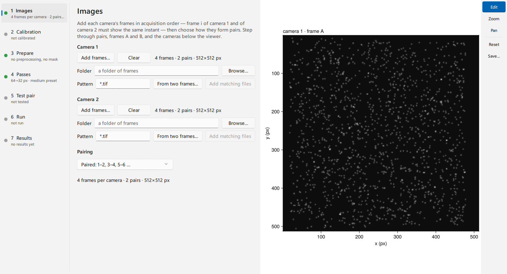
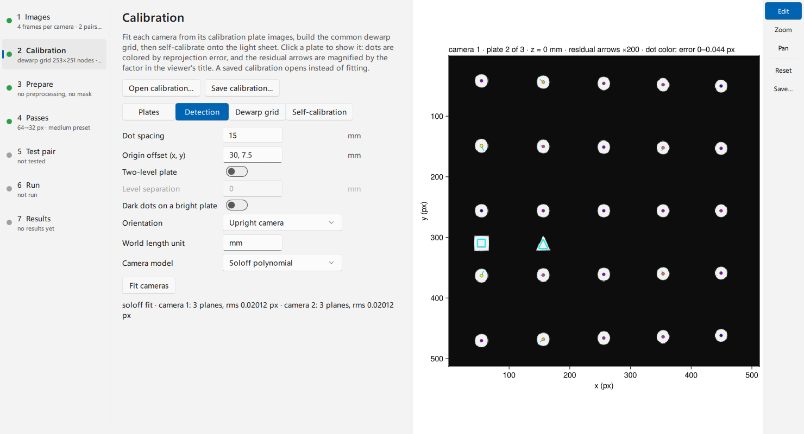
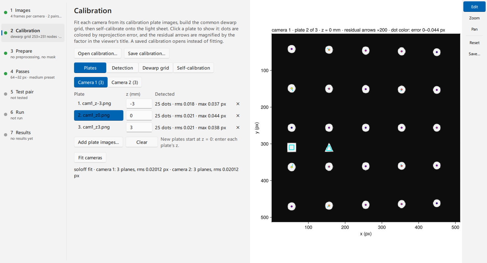
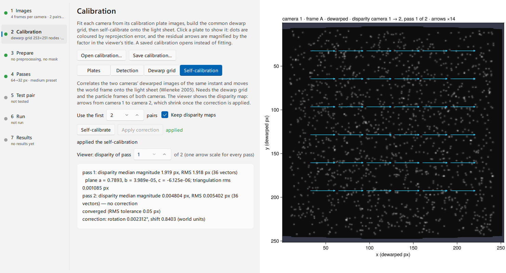
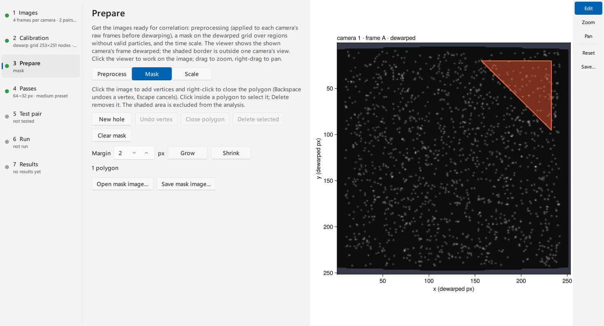
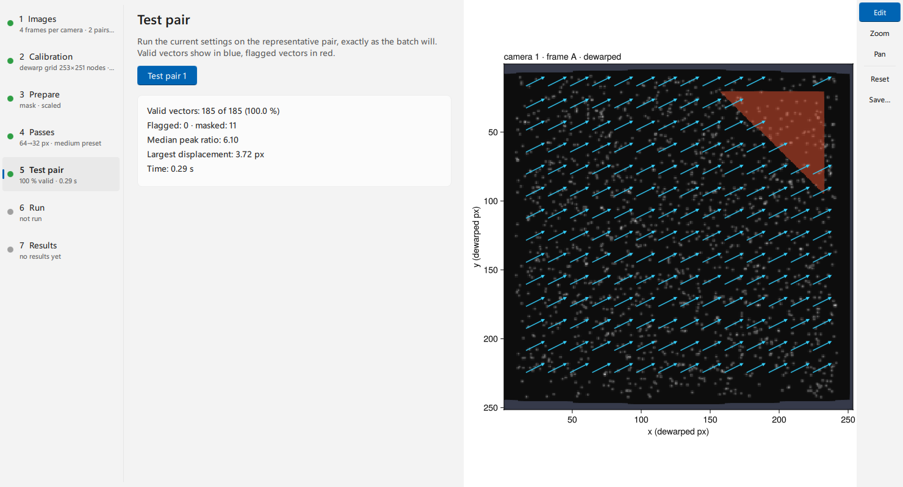
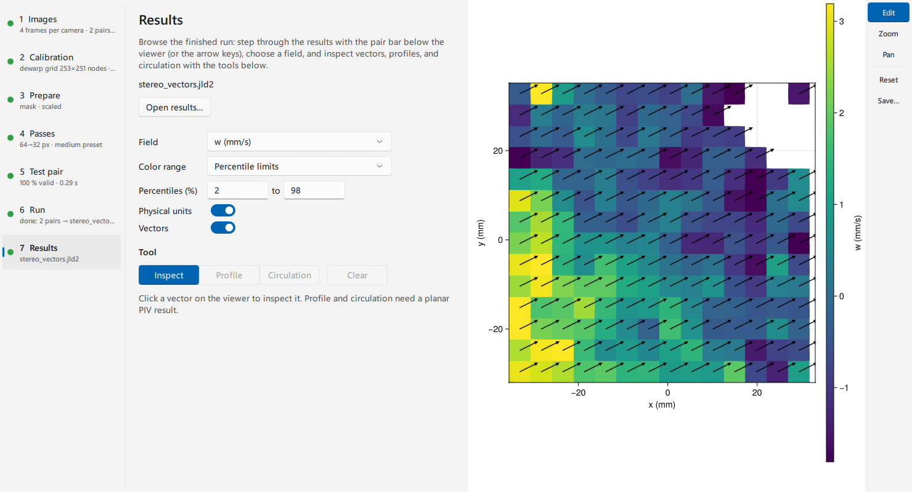

# Run stereo PIV in the GUI

Start with two cameras' frames of the same instants and each camera's
calibration plate images. In one window you will calibrate both cameras,
check the fits, build the common dewarped grid, move it onto the light sheet,
and then prepare, test and run the recording as in the planar window. The
result is three velocity components on a world-coordinate grid. For the
geometry behind each step, see
[Stereo geometry and self-calibration](../explanation/stereo.md); for the
same steps in a script, see [Calibrate a real stereo rig](stereo_rig.md).

## Open the window

Install the GUI package with `pkg> add HammerheadGUI`. Start Julia with
several threads, so fits, tests and runs leave the window responsive:

```julia
# julia -t auto
using HammerheadGUI
wf = stereo_window()
```

The call returns the window's `StereoWorkflow` when you close the window.
Pass each camera's frames to start further along:
`stereo_window(files1 = cam1_paths, files2 = cam2_paths)`.

The steps on the left run in order: **Images → Calibration → Prepare →
Passes → Test pair → Run → Results**. **Camera 1** and **Camera 2** in the
bar below the viewer choose which camera the viewer shows, on every step.
The viewer, the step rail, the pair bar and the pop-out work as in the
planar window; [Analyze an image pair in the GUI](gui.md) describes them.

## Add both cameras' frames

On **Images**, click **Add frames…** under **Camera 1**, then under
**Camera 2**. Entry *i* of both lists must show the same instant, so add
each camera's files in acquisition order. One **Pairing** rule and one
representative pair apply to both cameras. The step names the camera and
the problem when the lists disagree: different pair counts, frames of
different sizes, or frames of another size than the camera was calibrated
for.



## Calibrate the cameras

**Calibration** has four pages: **Plates**, **Detection**, **Dewarp grid**
and **Self-calibration**. The viewer shows the selected plate image of the
shown camera. The calibration belongs to the window session: **Save
settings…** stores the processing settings, and the plates, fits and
dewarpers stay with the open window. To reuse a calibration in a later
session, build the dewarpers in a script and pass them in (see
[Reuse a calibration](#Reuse-a-calibration)).

### Add the plate images

On **Plates**, choose **Camera 1**, click **Add plate images…**, and type
each plate's z position in the **z** column; new plates start at z = 0.
Repeat for **Camera 2**. A Soloff fit needs plates at three or more z
positions, a pinhole fit two. A two-level plate contributes two planes per
image. Plate images added as files appear on the viewer after the first fit,
which loads them.

### Set the detection and the camera model

On **Detection**, describe the plate:

- **Dot spacing** in world units (the **World length unit**, mm by default).
- **Origin offset (x, y)**: where the origin dot sits relative to the square
  marker. Both cameras use it to agree on the world origin, so set it
  whenever the plate has a marker.
- **Two-level plate** and its **Level separation**; **Dark dots on a bright
  plate** for inverted plates.
- **Orientation**: **Upright camera** takes +X towards image-right and +Y
  towards image-up. Choose **From the fiducial markers** for rolled cameras
  when both the square and the triangle marker are visible.
- **Camera model**: **Soloff polynomial** follows lens distortion and
  refraction; **Pinhole** needs fewer planes.

Click **Fit cameras**. Detection and fitting run in the background; the
status line reports each camera's plane count and RMS reprojection error,
or the reason a camera has no fit. Changing the model refits at once.
Changing a plate or a detection setting marks the fit out of date until you
fit again.



### Read the fit

Back on **Plates**, each plate lists its detected dots and RMS error. Click
a plate to show it. On the viewer, dots are coloured by reprojection error,
the fiducial markers are outlined, and the residual arrows are magnified by
the gain named in the title, so sub-pixel errors are visible.



- Small arrows in random directions are detection noise; this is a good fit.
- Arrows that turn smoothly across the image point to a model limit or
  refraction: compare the Soloff and pinhole fits.
- Large errors on a few dots, or on one plate only, point to detection or a
  wrong z: check the plate image and its z value.
- Check that the outlined square marker is the same physical marker in both
  cameras; a different marker shifts one camera's world origin.

[Calibrate a real stereo rig](stereo_rig.md) gives the residuals measured
on a real plate.

### Choose the dewarp grid

The fit builds the common grid both cameras are dewarped onto, and every
later step works on it. On **Dewarp grid**:

- **Coverage**: **Seen by both cameras** (the usual choice) or **Seen by
  either camera**. Nodes outside a camera's view are excluded either way.
- **Node spacing**: `auto` matches the coarser camera's pixel size. A coarser
  spacing makes the dewarped images smaller and faster to correlate; keep it
  finer than the vector spacing you want.
- **Plane z**: the world plane the grid lies in, normally the light sheet's
  nominal position. A positive **Margin** shrinks the grid on every side; a
  negative one grows it.

A changed option rebuilds the grid; **Build grid** rebuilds it on request.
The status line gives the grid size, spacing and z.

### Move the grid onto the light sheet

The plate and the light sheet rarely occupy exactly the same plane.
**Self-calibration** measures the disparity between the two cameras'
dewarped particle images of the same instant and moves the world frame onto
the sheet ([Wieneke2005](@cite)). On its page, choose how many of the first
pairs to use (every frame of those pairs, camera 1 against camera 2), then
click **Self-calibrate**. It uses the current preprocessing and mask. The
report lists, per pass, the disparity between the cameras and the fitted
sheet plane z = a + b·X + c·Y, and ends with the total correction. A pass
without a plane only measured the result. Click **Apply correction** to use
the corrected dewarpers.



In this example the light sheet lies 0.8 mm from the plate's z = 0. The
first pass measures a disparity of about 1.9 px and fits a = 0.79 mm with
negligible tilt; after the correction the disparity falls to 0.005 px, below
the 0.05 px tolerance, so the report says converged. A result that does not
converge, or a large triangulation RMS, calls for the disparity checks in
[Calibrate a real stereo rig](stereo_rig.md) before you apply it.

Apply the correction last. A new fit or grid option rebuilds the dewarpers
from the plates and drops the correction; self-calibrate again afterwards.
With **Keep disparity maps**, the returned workflow's
`wf.calibration.selfcal[].report` also holds the disparity fields, for the
checks in [Calibrate a real stereo rig](stereo_rig.md).

## Prepare the dewarped images

On **Prepare**, the viewer shows the shown camera's frame dewarped onto the
grid, in grid nodes. The shaded border is where at least one camera has no
view; it is excluded from every analysis.

- **Preprocess**: the operations and the correlation probe of the planar
  window. The steps run on both cameras' raw frames before dewarping, and
  the probe correlates the shown camera's dewarped pair. One list serves both
  cameras, so background subtraction, which differs per camera, is not
  offered here: subtract each camera's background from its frames before
  adding them when the recording needs it.
- **Mask**: draw polygons on the dewarped grid, as in the planar window. One
  mask applies to both cameras. Stereo analysis has no region page; mask the
  part of the grid you do not want instead.
- **Scale**: vectors are already in the calibration's world units per frame.
  Type the time between the paired exposures and its unit to show
  velocities.



## Choose the passes, test, and run

**Passes**, **Test pair** and **Run** are the planar window's steps; the
presets size the windows to the dewarped grid. Both cameras run with the
same passes, and their two-component fields combine into three components
at every node. **Test pair** runs the call the batch will run, and the
viewer shows the in-plane vectors on the shown camera's dewarped frame.
**Run** writes one stereo result per pair, with the settings, as each pair
finishes; an ensemble writes one pooled stereo result when both cameras'
correlations have been summed over every pair.



## Inspect the results

**Results** shows stereo fields on world axes, with +Y up: the components
u, v and w, their magnitudes, and their uncertainties when the final pass
estimates them. **Inspect** reads one vector. The profile and circulation
tools work on planar results.



## Save and reuse the settings

**Save settings…** writes the passes, preprocessing, mask and scale as a
core recipe; **Open settings…** reads one, or the settings stored in a
results file. Planar settings with an analysis region do not open here:
remove the region, or mask the grid instead. A script runs the same
settings with `apply_recipe(recipe, pairs1, pairs2, dw1, dw2)`; see
[Save settings and reuse them](recipes.md).

### Reuse a calibration

When the window closes, `wf.calibration.dewarpers[]` holds the dewarper
pair. Pass it to the next window in the same Julia session, or build a
pair in a script from the plate images:

```julia
using Hammerhead, HammerheadGUI

zs = [-3.0, 0.0, 3.0]                  # plate positions, mm
detect = (; spacing = 15.0, origin_offset = (30.0, 7.5))
cr1 = CalibrationReview(cam1_plate_paths, zs; detect...)
cr2 = CalibrationReview(cam2_plate_paths, zs; detect...)
dw1, dw2 = build_dewarpers(cr1, cr2)   # common grid at z = 0

wf = stereo_window(files1 = cam1_paths, files2 = cam2_paths,
                   dewarpers = (dw1, dw2), settings = "stereo_settings.jld2")
```

The window then starts at a calibrated rig: self-calibrate on the
recording's frames, or go straight to **Prepare**. To review one camera's
fit first, run `calibration_review(cr1)` in a separate Julia session: it is
a GLMakie window, and some graphics drivers fail when GLMakie and Qt windows
share a process. Once a GLMakie window exists, `stereo_window` throws an
error asking you to restart Julia; `calibration_review`, `selfcal_review`,
and `result_explorer` warn when a workflow window was already open.
